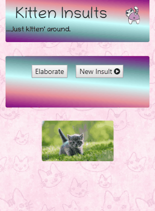

# Kitten-Insult-Generator
## Overview
Kitten Insults generates a random sentence made up of two adjectives and a random noun, situated above a randomly generated picture of a cat.
Our team used three different APIs for this: The Words API, The Merriam-Webster Dictionary API, and The Cat API.

For a demo of the app, visit: <https://digipet007.github.io/Kitten-Insult-Generator/>

## Technologies Used
- JavaScript
- Jquery
- Anime.js
- Bootstrap CSS
- Google Firebase (for monitoring purposes)
- Moment.js

### API Calls
- Words API
- The Merriam-Webster Dictionary API
- The Cat API

## View the Code on Github
<https://github.com/digipet007/Kitten-Insult-Generator>

## Usage
To generate a completely new insult, press the 'New Insult' button. To add words to an insult already generated, press the 'Elaborate' button and new words will be added to the existing insult.

> Collaborators: Sarah Arnold [@digipet007](https://github.com/digipet007), Jack Brettell [@jackb312](https://github.com/jackb312), Linlin Xing [@Ohmydearcheesus](https://github.com/Ohmydearcheesus), Cedar Thuotte [@juniperhaven](https://github.com/juniperhaven)  
